# Banana Spoilage Detection — Multimodal Deep Learning System
## [Live Link](https://banana-spoilage-detection.streamlit.app/)

## Overview

This project implements a multimodal deep learning framework for non-destructive, automated classification of banana ripeness and early spoilage detection. The system fuses four complementary sensing modalities — RGB imaging, hyperspectral reflectance, volatile organic compound (VOC) sensor outputs, and ambient environmental measurements — using a confidence-weighted late fusion strategy.

The framework classifies bananas into four categories: **Unripe**, **Ripe**, **Overripe**, and **Rotten**.

---

## Pipeline

---
